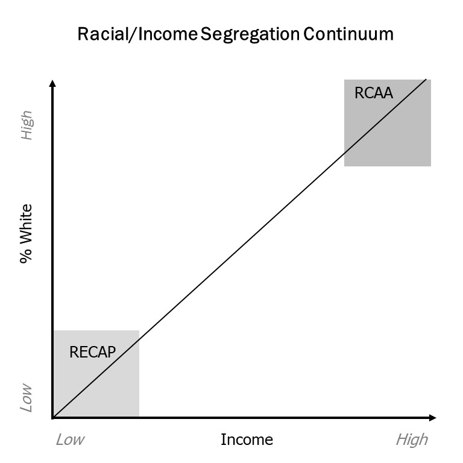
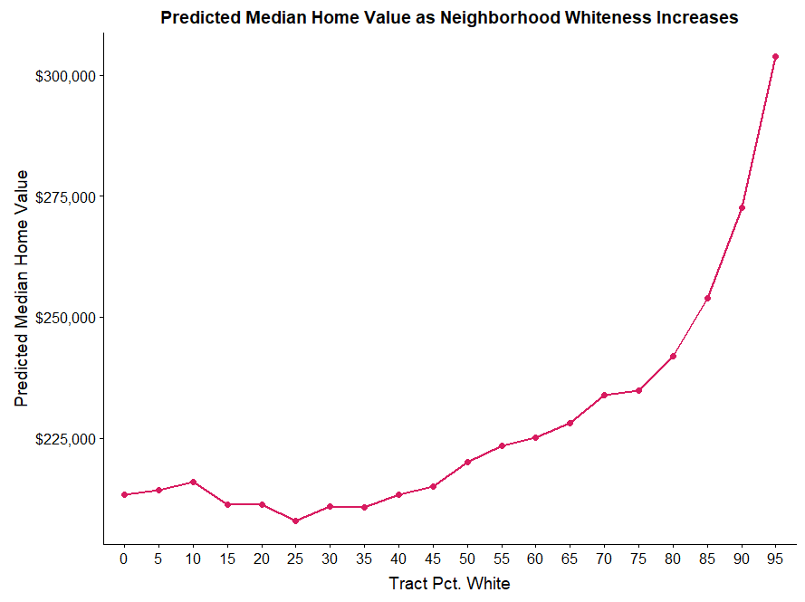

<!-- Learn more about flexdashboard at https://rstudio.github.io/flexdashboard -->


```{r setup, include=FALSE}

library(shiny)
library(tidyverse)
library(leaflet) # devtools::install_github('rstudio/leaflet')
library(plotly) # devtools::install_github('ropensci/plotly')
library(flexdashboard) # devtools::install_github('rstudio/flexdashboard')
library(sp)
library(DT)


mn <- c("Atlanta, GA", "Austin, TX", "Baltimore, MD", "Birmingham, AL", "Boston, MA", "Buffalo, NY", "Charlotte, NC", "Chicago, IL", "Cincinnati, OH", "Cleveland, OH", "Columbus, OH", "Dallas-Fort Worth, TX", "Denver, CO", "Detroit, MI", "Hartford, CT", "Houston, TX", "Indianapolis, IN", "Jacksonville, FL", "Kansas City, MO", "Las Vegas, NV", "Los Angeles, CA", "Louisville, KY", "Memphis, TN", "Miami, FL", "Milwaukee, WI", "Minneapolis-St. Paul, MN", "Nashville, TN", "New Orleans, LA", "New York City, NY", "Oklahoma City, OK", "Orlando, FL", "Philadelphia, PA", "Phoenix, AZ", "Pittsburgh, PA", "Portland, OR", "Providence, RI", "Raleigh, NC", "Richmond, VA", "Riverside-San Bernardino, CA", "Sacramento, CA", "St. Louis, MO", "Salt Lake City, UT", "San Antonio, TX", "Sand Diego, CA", "San Francisco, CA", "San Jose, CA", "Seattle, WA", "Tampa, FL", "Virginia Beach, VA", "Washington, DC")

# Read in data, and subset for the selected metro
ihs <- function(x) {log(x + (x^2 + 1)^(1/2))}

rcaap_trcts <- read_rds("rcaap_sp.rds")


lev <- c("RCAA", "RECAP", "Other")

tractdf <- read_rds("tractdf.rds") %>% 
  mutate(
    segindex = ifelse(is.na(segindex), "Other", segindex),
    segindex = factor(segindex, levels = lev)
    )

metro_data <- read_rds("metdata.rds") %>% 
  rename(MGEOID = GEOID) %>% 
  mutate(
    iprecap = round(ihs(prcapp),2),
    iprcaa  = round(ihs(prcaaw), 2)
  )

metro_data$NAME <- mn

md <- metro_data %>% 
  mutate(
    medinc = scales::dollar(medinc),
    medval = scales::dollar(medval),
    medrent = scales::dollar(medrent),
    totpop = round(totpop/1000000,2)
  ) %>% 
  select(Metro = NAME, 
         Region, 
         `N.Trcts` = n_tracts,
         `N.RRCAA`         = rcaa_w,
         `N.RECAP`        = rcap_p,
         `%.RCAA`     = prcaaw,
         `%.RECAP`    = prcapp,
         `%.Wht` = pctw,
         `%.PoC` = pctp,
         `Med.Inc` = medinc,
         `%.Pov` = pctpov
         )

# Define the list of available metros
lookup <- structure(unique(metro_data$MGEOID), .Names = unique(metro_data$NAME))


#function to select spatial RCAA/RECAP Tracts
sm_tracts <- reactive({
  
  m <- rcaap_trcts[rcaap_trcts$MGEOID == input$metro_name, ]
  
  return(m)
  
})

#Function to filter tract aspatial data
sm_tracts_df <- reactive({
  
  m <- tractdf[tractdf$MGEOID == input$metro_name, ]
  
  return(m)
  
})

```


Map
======================================================================

Inputs {.sidebar}
--------------------------------------------------------------


This website is part of a larger project to understand the understudied phenomenon of white, affluent segregation. We refer to these neighborhoods as Racially Concentrated Areas of Affluence (RCAA). 

As part of our initial analysis,we mapped and analyzed patterns of RCAA as well as the more commonly studied Racially/Ethnically Concenrated Areas of Poverty (RECAP) in the 50 largest metro areas in the US. 

To learn more about the project, click the __About__ tab. 

Use the __Explore metros__ tab to view and download metro area level data.

Use this page to explore the map and download tract level data for a selected metro area.

```{r}

# Define inputs
selectInput('metro_name', label = 'Select a metropolitan area', choices = lookup, selected = "33460")

# Set up data download
data_for_dl <- reactive({
  
 dat <- sm_tracts_df()
  
})

output$downloadCSV <- downloadHandler(
  filename = 'data.csv', 
  content = function(file) {
    write_csv(data_for_dl(), file)
  }
)

downloadLink('downloadCSV', label = 'Download census tract data for selected metro area')

```

</br>

__Definitions__

- __RECAP__ (Federally defined) are census tracts that are at least 50% people of color and have a poverty rate greater than 40%
-  __RCAA__ (Author defined) are census tracts that are at least 80% white and have a median household income of at least $125,000


</br>

__Credits__
All data represent the authors' calculations using data from the 2012-2016 American Community Survey 5-year estimates.

Project authors: Edward Goetz, Anthony Damiano & Rashad Williams

Website built by [Tony Damiano](https://www.tonydamiano.com/) using R, Shiny, and R Studio

Column
--------------------------------------------------------------------------
### Map of RCAA / RECAP

```{r}
# Draw the map without selected tracts
output$map <- renderLeaflet({

go <- c("#DB3916", "#0A6163") #Green / Organge
rb <- c("#D81B60", "#1E88E5") # red / blue

  
pal <- colorFactor(rb, domain = sm_tracts()$segindex, na.color = NA)

mytext <- paste0("<b> % white:</b> ", round(sm_tracts()$pctwht,1), "<br/>",
                 "<b> % black:</b> ", round(sm_tracts()$pctblk,1), "<br/>",
                 "<b> % hispanic:</b> ", round(sm_tracts()$pcthisp,1), "<br/>",
                 "<b> % asian:</b> ", round(sm_tracts()$pctasian,1), "<br/>",
                 "<b> median hh inc:</b> ", scales::dollar(sm_tracts()$medinc), "<br/>",
                 "<b> % poverty:</b> ", round(sm_tracts()$pctpov,1), "<br/>",
                 "<b> % homeowner:</b> ", round(sm_tracts()$pctown,1), "<br/>",
                 "<b> median home value:</b> ", scales::dollar(sm_tracts()$medval), "<br/>",
                 "<b> median rent:</b> ", scales::dollar(sm_tracts()$medrent), "<br/>"
                 ) %>%
  lapply(htmltools::HTML)
  
map <- leaflet(sm_tracts()) %>%
  addProviderTiles('CartoDB.Positron') %>%
  clearShapes() %>%
  addPolygons(stroke = FALSE, smoothFactor = 0, 
              color = ~pal(segindex), fillOpacity = ~segindex, 
              layerId = ~GEOID,
              label = mytext,
              labelOptions = labelOptions( style = list("font-weight" = "normal", padding = "3px 8px"),
                                           textsize = "12px", direction = "auto")) %>% 
  addLegend(position = "bottomright", pal = pal, 
            values = sm_tracts()$segindex, title = "RCAA/RECAP")
    
    map
    
  })


leafletOutput('map')  

```


Explore Metros {data-orientation=rows}
============================================================================

row {data-height=600}
--------------------------------------------

### Search and sort metro-level data

```{r}
output$downloadmCSV <- downloadHandler(
  filename = 'metro_data.csv',
  content = function(file) {
    write_csv(metro_data, file)
  }
)

downloadLink('downloadmCSV', label = 'Download Metro-level data')

```


```{r}

#Render DT
output$dt1 <- renderDataTable(md, selection = 'single',
          options = list(
          initComplete = JS(
        "function(settings, json) {",
        "$(this.api().table().header()).css({'font-size': '75%'});",
        "}"),
        rowCallback = JS("function(r,d) {$(r).attr('height', '20px')}")
        )) 
        
dataTableOutput("dt1")
```


row
-----------------------------------------------------------
### RCAA/RECAP Metro Area Distribution
    
```{r}

output$metroScatter <- renderPlotly({
  
  vline <- function(x = 0, color = "grey") {
  list(
    type = "line", 
    y0 = 0, 
    y1 = 1, 
    yref = "paper",
    x0 = x, 
    x1 = x, 
    line = list(color = color)
  )
}

hline <- function(y = 0, color = "grey") {
  list(
    type = "line", 
    x0 = 0, 
    x1 = 1, 
    xref = "paper",
    y0 = y, 
    y1 = y, 
    line = list(color = color)
  )
}

#Hover text
ht <- ~paste("</br> Name: ",   NAME,
             "</br> % RCAA: ", iprcaa, 
             "</br> % RECAP: ", iprecap)

ax <- list(title = '% RCAA',
           zeroline = FALSE,
           range = c(-0.1, 4),
           showticklabels = FALSE)


ay <- list(title = '% RECAP',
           zeroline = FALSE,
           range = c(-0.1, 4),
           showticklabels = FALSE)

p <- plot_ly(data = metro_data, x = ~iprcaa, y = ~iprecap, type = "scatter", mode = "markers",
             hoverinfo = "text",
             color = ~Region,  
             text = ht, 
             colors = c("#FF2600", "#029F8A", "#F2AD00", "#5BBCD6")
) %>%
  add_text(text =~mabr, textposition = "top right") %>% 
  layout(shapes = list(vline(ihs(median(metro_data$prcaaw))), 
                       hline(ihs(median(metro_data$prcapp)))),
         xaxis = ax,
         yaxis = ay)
  
})

plotlyOutput("metroScatter")
```
   
### Selected Metro Area Race/Income Segregation Continuum
```{r}

clk <-  eventReactive(input$dt1_rows_selected, {
  return(input$dt1_rows_selected)
})

tract_data <- reactive({
  
  #get id from Clicked Track
  metro_id <- as.character(metro_data[clk(), 1])
  
  tract_data <- as.data.frame(tractdf[tractdf$MGEOID == metro_id,])
  
  return(tract_data)

  })


#Plotly
output$tractScatter <- renderPlotly({


mname <- first(tract_data()$METRON)

p <- plot_ly(data = tract_data(), x = ~medinc , y = ~pctwht, type = "scatter", mode = "markers", 
        color = ~segindex,
        colors =  c("#D81B60", "#1E88E5", "#c4c8ce")) %>% 
  layout(title = mname,
         xaxis = list(title = "Median Household Income"),
         yaxis = list(title = "Pct. White"))

p

})


plotlyOutput('tractScatter')

```


About
============================================================================
<div id= "prettyText">
<h3>What are Racially Concentrated Areas of Affluence</h3>

RCAA are segregated, affluent white communities. We define these communities as neighborhoods (census tracts) that are at least 80% white and have a median household income greater than $125,000

<h3>Why are these places worth studying?</h3>


```{r}

```


The ability of urban planning to fully understand and address America’s urban problems of inequality and residential segregation is hampered by the neglect of whiteness and its role in shaping urban outcomes. The focus of planners, scholars, and public discourse is often exclusively on the ‘dysfunctions’ of communities of color, notably their poverty, high levels of segregation and isolation. This has diverted attention from investigation of the structural systems that produce and reproduce the advantages of affluent and white neighborhoods. 

Racial and economic segregation exist on a continuum (see above). Public officials and scholars frequently invoke a “legacy of injustice” with regard to concentrated poverty and disadvantage, but not in regards to neighborhoods of concentrated white affluence. For example, the federal government requires that all communities that receive grant money from the Department of Housing and Urban Development (HUD) create maps of Racially/ethnically Concentrated Areas of Poverty (RECAP). These areas are typically defined as census tracts that have a poverty rate of at least 40% and are at least 50% people of color. However, there is no mandate to document white, affluent segregation. RECAP are segregated and problematized, while RCAA are idealized. 
 
<h3>How do we measure RCAA?</h3>

For this analysis, we define RCAA as neighborhoods (census tracts) that are at least 80% White and have a median household income greater than $125,000. Data for this analysis come from the 2012-2016 American Community Survey.
We posit that, in the same way neighborhood disadvantage is associated with concentrated poverty and high concentrations of people of color, conversely, distinct advantages are associated with residence in affluent, white communities. We hypothesize that the returns of living in predominantly White and affluent neighborhoods are nonlinear and accelerate at the high end. We use census tract median home value as a proxy for neighborhood advantage. Home values represent a reasonable indicator of neighborhood advantage because they not only capture the quality of the housing stock, they also capture neighborhood characteristics associated with advantages, including good schools, low crime, job proximity, and environmental quality. Finally, and most obviously, they are themselves a form of wealth.

```{r}

```

As the graphic above illistrates, even after controlling for other neighborhood characteristics, there are still significant material advantages to living in white neighborhoods. Not only does neighborhood advantage increase as whiteness increases, the benefits accelerate as a neighborhood approaches 100% white. We used several statistical methods to identify where this trend becomes non-linear which was at approximately 80% White (see the methodological section of our paper for more information). Following [other researchers](https://journals.sagepub.com/doi/10.1177/107808749603200203), we adopted $125,000 as the standard defining concentrated affluence. This is approximately 2 times the national median household income and represents ecnomic advantage. In short, both neighborhood whiteness and neighborhood income offer distinct advantages. When these two types of advantage are combined, the result is that 


<h3>Racially Concentrated Areas of Affluence : A Preliminary Investigation (Forthcoming)<h3/>

<h4>Abstract<h4/>

“Racially/Ethnically Concentrated Areas of Poverty” (RECAPs) have become an official focus of policy attention for the U.S. Department of Housing and Urban Development (HUD) through the 2015 rule regarding local governments’ obligations to Affirmatively Further Fair Housing. In this article, we argue for equal attention to the other end of the segregation continuum, affluent White neighborhoods, or what we call “Racially Concentrated Areas of Affluence” (RCAAs). We examine the prevalence and characteristics of RCAAs in the 50 largest metropolitan areas of the United States. Our findings show that RCAAs, as we define them, are not as prevalent as RECAPs, accounting for an average of 2.19 percent of all tracts in the 50 largest metro areas compared with RECAPs, which are an average of 4.68 percent of metro tracts. RCAAs are more common in several metropolitan areas than RECAPs. The two phenomena seem to be related; controlling for group size, the correlation between metro area shares of RCAAs and RECAPs is moderately positive. We conclude by offering reasons for focusing policy attention on RCAAs that include acknowledging the various public policies that have created these enclaves of advantage and the ways in which current and past public policies have subsidized them.

<h4>Reproducible Version<h4/>
Code for the analyses used in this paper as well as for this website are available here. We are working hard to make as much of the empirical work accessible, reproducible, and open. 


__Citation__

Goetz, E. G., Damiano, A., & Williams, R. A. (2019). _Racially Concentrated Areas of Affluence: A Preliminary Investigation_. Cityscape: A Journal of Policy Development and Research, 21(1), 99–124.
[Link to pdf](https://www.huduser.gov/portal/periodicals/cityscpe/vol21num1/ch4.pdf)


<h4>Future Research</h4>

  - Williams R.A., Goetz, E.G., Damiano, A.P. & (Draft completed). _Concentrated White Affluence and Urban Planning_
  - Historical Development of Racially Concentrated Areas of Affluence (In development)


All data represent the authors' calculations using data from the 2012-2016 American Community Survey 5-year estimates unless otherwise noted.

Project authors: Edward Goetz, Anthony Damiano & Rashad Williams

Website built by Tony Damiano using R, Shiny, and R Studio
Special thanks to [Kyle E. Walker] for use of 

</div>


<style>

.body {
background-color: white;
}

.section.sidebar {

  background-color: white;
  font-family: "Open-Sans", "Helvetica Neue", Helvetica, Arial, sans-serif;
}

#prettyText {
  width: 800px;
  margin: auto;
  font-size: 18px;
}

</style>


